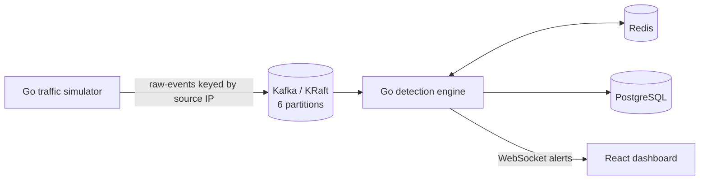

# Sentinel

Sentinel is a real-time API threat detection and traffic monitoring system. It is being built incrementally as a portfolio project, with the detection engine, tests, measurements, and architectural trade-offs documented as each phase lands.

> **Current status:** End-to-end MVP — simulated traffic flows through Kafka into the configurable detector, Redis-backed detection state, PostgreSQL alert history, and the live React dashboard.

## Current architecture



## Run locally

Requirements: Docker Desktop with Docker Compose.

```bash
cp .env.example .env
docker compose up --build
```

Then open [http://localhost:5173](http://localhost:5173). The detector health endpoint is at [http://localhost:8080/health](http://localhost:8080/health).

The `.env` copy is optional because Compose includes safe local defaults. It becomes useful when ports, credentials, traffic modes, or service locations need to change.

Stop the stack with `docker compose down`. Add `-v` only when you intentionally want to delete local Kafka, Redis, and PostgreSQL data.

## Repository layout

```text
sentinel/
├── ingestion/       # Go simulator and Kafka producer
├── detector/        # Go consumer and detection engine
├── dashboard/       # React + Vite operations dashboard
├── .env.example
├── docker-compose.yml
└── README.md
```

## Phase 1 decisions

- **KRaft Kafka:** Kafka's built-in metadata quorum avoids carrying ZooKeeper as a separate legacy dependency. A single broker is appropriate for reproducible local development, not high availability.
- **Service-owned boundaries:** ingestion, detection, and presentation are independently buildable. Traffic generation can be scaled or stopped independently from detection.
- **Health-gated startup:** topic creation waits for Kafka; ingestion and detection wait for topic creation; the dashboard waits for the detector.
- **Persistent development volumes:** broker logs, Redis state, and Postgres data survive container restarts, which makes debugging replays and offsets practical.
- **Distroless Go runtimes:** compiled services run as non-root in small images. Build toolchains stay outside runtime containers.
- **Live operational boundary:** `/health`, `/api/rules`, `/api/alerts`, `/api/summary`, and `/ws` are served by the detector. WebSocket clients use bounded buffers so a slow browser cannot stall detection.

## Phase 2 traffic ingestion

The simulator emits a versioned JSON event contract with timestamp, source IP, endpoint, method, status, user agent, response time, optional query/body content, and a scenario label. Normal traffic varies endpoints, outcomes, and latency across a stable pool of 48 clients, giving the future anomaly detector enough repeated history to learn meaningful baselines. Test modes generate:

- `credential-stuffing`: repeated fast `401` login attempts from one IP with varied credentials.
- `scraping`: sequential product resource IDs from one IP.
- `injection`: URL-encoded SQL injection and XSS signatures.
- `spike`: bursts from one source at `rate × spike-multiple`.
- `mixed`: normal traffic with a malicious event inserted every `attack-every` events.

The default Compose service runs mixed traffic continuously at 25 events/second. Override values in `.env`, or launch a finite scenario on demand:

```bash
docker compose run --rm ingestion -mode credential-stuffing -rate 50 -count 250
docker compose run --rm ingestion -mode scraping -rate 20 -count 100
docker compose run --rm ingestion -mode injection -rate 10 -count 40
docker compose run --rm ingestion -mode spike -rate 25 -spike-multiple 20 -count 500
```

### Why partition by source IP?

Every Kafka record uses `source_ip` as its message key. Kafka hashes that key, so all events from one client land on the same partition and remain ordered. The detector can therefore maintain source-specific sliding windows and recognize sequences without coordinating state across consumers. Six partitions allow up to six detector consumers to share work locally.

The trade-off is skew: a very noisy source can make one partition hotter than the others. At larger scale, Sentinel would monitor partition lag and could salt keys for known extreme sources, accepting the extra state-aggregation cost only where necessary.

The producer has a bounded 10,000-record buffer. When it fills, publishing blocks and slows generation, providing backpressure instead of silently dropping synthetic events. Shutdown allows up to 15 seconds to flush acknowledged records.

## Roadmap

- [x] Phase 1: monorepo scaffolding and Docker Compose
- [x] Phase 2: traffic simulator and partitioned Kafka producer
- [x] Phase 3: configurable detection engine and WebSocket alerting
- [x] Phase 4: idempotent PostgreSQL schema and persistence model
- [x] Phase 5: live dashboard history, summaries, and alert stream
- [x] Phase 6: detector and simulator unit tests
- [x] Phase 7: architecture, operating notes, and limitations
- [x] Phase 8: CI checks

## API

- `GET /health` — detector readiness
- `GET /api/rules` — active detector configuration
- `GET /api/alerts?limit=100` — newest persisted alerts (maximum 500)
- `GET /api/summary` — alert counts by severity over the last 24 hours
- `GET /ws` — live JSON alert stream

## Limitations

Sentinel is a local single-broker portfolio deployment, not a high-availability production topology. Rule configuration is loaded at startup, authentication/TLS are intentionally outside the local demo boundary, and the dashboard's hot-source ranking uses its most recent 100 alerts. Unit tests cover the deterministic detectors and simulator; reproducible throughput claims require a dedicated load-test environment and are intentionally not estimated here.
